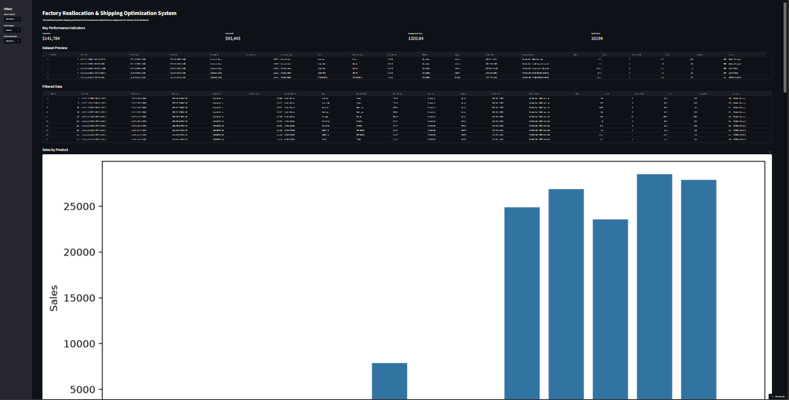

# 🍬 Nassau Candy Business Analytics & Optimization Platform

## Overview

The Nassau Candy Business Analytics & Optimization Platform is a data-driven decision support system designed to analyze sales performance, profitability, shipping efficiency, and operational metrics.

The platform helps business stakeholders identify high-performing products, monitor regional sales trends, evaluate shipping performance, and support strategic decision-making through interactive dashboards.

---

## Problem Statement

Businesses generate large amounts of operational and sales data but often struggle to:

* Monitor product performance effectively
* Identify profitable product categories
* Track shipping and delivery efficiency
* Analyze regional business performance
* Make data-driven operational decisions

This project transforms raw business data into actionable insights.

---

## Key Features

### 📊 Executive KPI Dashboard

* Total Sales Monitoring
* Profit Tracking
* Order Volume Analysis
* Performance Metrics

### 📈 Sales Analytics

* Product-wise Sales Analysis
* Regional Sales Comparison
* Category Performance Evaluation
* Trend Analysis

### 🚚 Shipping Intelligence

* Shipping Mode Analysis
* Delivery Performance Monitoring
* Lead Time Evaluation

### 🔍 Interactive Business Filters

* Product Filters
* Region Filters
* Category Filters
* Shipping Filters

### 📋 Data Exploration

* Dataset Preview
* Filtered Business Insights
* Interactive Tables

---

## Technology Stack

* Python
* Pandas
* NumPy
* Streamlit
* Plotly
* Matplotlib
* Seaborn

---

## Dashboard Preview

### Main Dashboard



---

## Project Workflow

1. Data Collection
2. Data Cleaning
3. Data Transformation
4. Exploratory Data Analysis
5. KPI Development
6. Business Performance Analysis
7. Visualization & Reporting
8. Decision Support Insights

---

## Business Impact

* Improved business visibility
* Faster decision-making
* Better sales performance monitoring
* Enhanced operational efficiency
* Data-driven business strategy

---

## Future Enhancements

* Predictive Sales Forecasting
* Customer Segmentation
* Demand Prediction Models
* Automated Recommendation Engine
* Real-Time Analytics

---

## Installation

```bash
git clone https://github.com/kush-kumar-jha/Nassau-Candy-Optimization.git
```

```bash
pip install -r requirements.txt
```

```bash
streamlit run app.py
```

---

## Author

**Kush Kumar Jha**

B.Tech CSE (Data Science)
Chandigarh University

GitHub: https://github.com/Kush-kumar-jha

LinkedIn: https://www.linkedin.com/in/kushjha7
